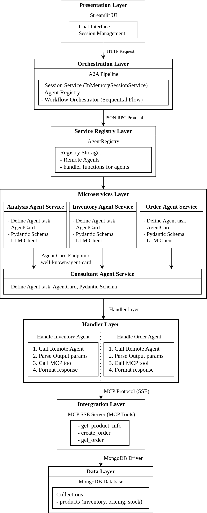
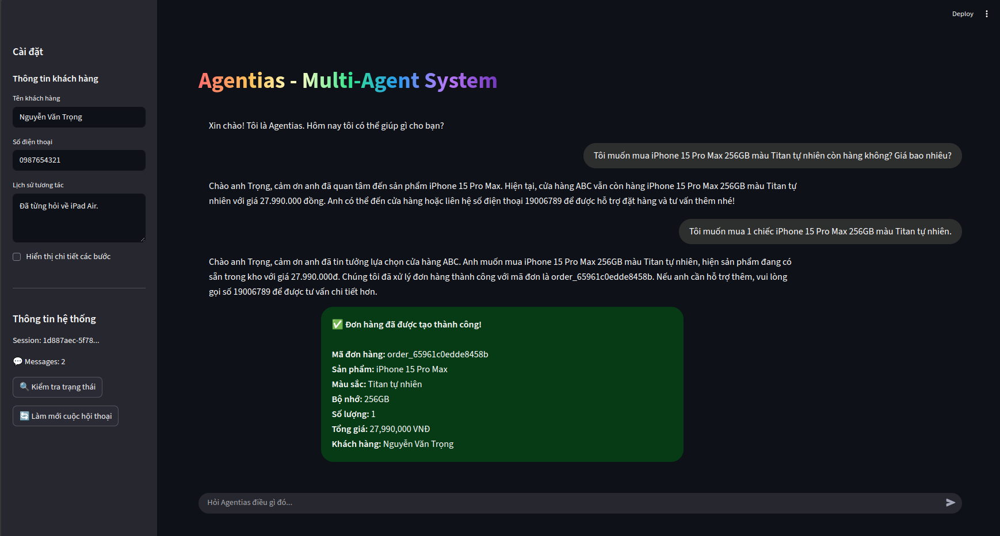

# Multi-Agent System with MCP SSE Server

[](https://www.python.org/downloads/)
[](https://opensource.org/licenses/MIT)

A sophisticated multi-agent system for e-commerce consultation and order processing, powered by **Google ADK** and **Model Context Protocol (MCP)** with Server-Sent Events (SSE) architecture. Since November 2025 the project ships two complementary orchestration modes:

- **ReAct Pipeline** – the original reasoning + acting loop with explicit tool calls typed by the LLM
- **A2A Pipeline** – The A2A pipeline follows the Microservice Achitecture recommended by Google ADK: every specialist agent is deployed as its own uvicorn service via `to_a2a()`, and the orchestrator talks to them through the official A2A protocol using `RemoteA2aAgent`.

## 🎯 Overview

This system implements an sales Agent using sequential pattern with multiple agents communicate through A2A protocol that collaborate to:
- Analyze customer inquiries and product requirements
- Check real-time inventory availability and pricing
- Process and persist customer orders
- Provide natural language consultation

The agents communicate with an MCP SSE server that interfaces with MongoDB for product inventory and order management.

## 🏗️ Architecture

### Agent Pipelines
#### Microservice Agent (A2A) Pattern


Each agent runs in a separate uvicorn microservice, generating agent cards at `/.well-known/agent-card.json`.

The Orchestrator uses `RemoteA2aAgent` to send the A2A payload to each service, and the agent itself is responsible for calling the MCP tools.

### Core Agents

1. **Analysis Agent**: Parses customer intent and extracts product details
2. **Inventory Agent**: Extracts product parameters; in A2A mode the handler calls `check_inventory_detail`
3. **Order Agent**: Prepares order payload; in A2A mode the handler calls `create_customer_order`
4. **Consultant Agent**: Generates natural language responses for customers

### Technology Stack

- **Agent Framework**: Google ADK (Agent Development Kit)
- **LLM Integration**: LiteLLM with vLLM backend
- **Protocol**: Model Context Protocol (MCP) with SSE transport
- **Database**: MongoDB for inventory and order storage
- **UI**: Streamlit for interactive chat interface
- **Containerization**: Docker & Docker Compose
- **Agent-to-Agent**: Agent Card registry with tool handlers invoking MCP directly

## 🚀 Features
- **A2A Communication**: AgentRegistry + `RemoteA2aAgent` act as the phone book/client to the remote microservices (each service exposes an agent card via `to_a2a`).
- **Deterministic Tool Calls**: Remote inventory/order services own the MCP calls, ensuring every request hits the SSE server the same way
- **MCP SSE Integration**: Async communication with MCP server via Server-Sent Events
- **Real-time Inventory Lookup**: Query product availability, pricing, and stock quantities
- **Order Management**: Create, persist, and track customer orders
- **Robust Parsing**: Resilient JSON/function-call extraction with structured fallbacks
- **Session Management**: Maintain conversation context across multiple turns
- **Streamlit UI**: User-friendly chat interface with agent traces and order cards

## 📋 Prerequisites

- Python 3.11+
- Docker & Docker Compose (for containerized deployment)
- vLLM server running at `http://localhost:8000/v1` (or configure your own endpoint)

## 🛠️ Installation

### Local Development

1. **Clone the repository**
```bash
git clone <your-repo-url>
cd agentADK
```

2. **Create and activate conda environment**
```bash
conda create -n agentadk python=3.11
conda activate agentadk
```

3. **Install dependencies**
```bash
pip install -r requirements.txt
```

4. **Start MongoDB**
```bash
sudo systemctl start mongod
```

5. **Configure environment** (optional)
```bash
cp .env.example .env
# Edit .env with your settings
```

### Docker Deployment

1. **Build and run all services**
```bash
docker-compose up --build
```

This will start:
- MongoDB on `localhost:27017`
- MCP SSE Server on `localhost:8000`
- Streamlit UI on `localhost:8501`

## 🚀 Usage

### Start MCP SSE Server

```bash
conda activate agentadk && python mcp_server.py
```

The MCP server exposes:
- SSE endpoint: `http://localhost:8000/sse`
- Tools:
  - `get_product_info`: Query inventory by product name, storage, color
  - `create_order`: Persist customer orders
  - `get_order`: Retrieve order details

### Start Remote A2A Microservices

Run each agent in a separate terminal. The default ports can be changed via the `A2A_*` environment variables in `.env`.

**Terminal 1 – Analysis Agent:**
```bash
conda activate agentadk && python -m uvicorn src.a2a_services.analysis_agent:app --host 0.0.0.0 --port 9101
```

**Terminal 2 – Inventory Agent:**
```bash
conda activate agentadk && python -m uvicorn src.a2a_services.inventory_agent:app --host 0.0.0.0 --port 9102
```

**Terminal 3 – Order Agent:**
```bash
conda activate agentadk && python -m uvicorn src.a2a_services.order_agent:app --host 0.0.0.0 --port 9103
```

**Terminal 4 – Consultant Agent:**
```bash
conda activate agentadk && python -m uvicorn src.a2a_services.consultant_agent:app --host 0.0.0.0 --port 9104
```

**Check Agent Card:**
```bash
# Analysis Agent card
curl http://localhost:9101/.well-known/agent-card.json
```

### Run Multi-Agent Pipelines

**Make sure the MCP SSE server and all A2A microservices are running before activating the pipeline.**

```bash
conda activate agentadk && python main.py
```

### Run Streamlit UI

```bash
conda activate agentadk && python -m streamlit run src/ui/app.py
```

Navigate to `http://localhost:8501` in your browser.

**UI Features:**
- Real-time chat with agent (uses Agent Card pipeline by default)
- Order details display panel with MCP output
- Agent trace expander showing per-agent JSON payloads
- Session persistence across page refreshes

## 📁 Project Structure

```
agentADK/
├── src/
│   ├── agents/
│   │   ├── agents_react.py        # ReAct-style agents with tool instructions
│   │   └── routes.py              # RemoteA2aAgent wrappers (point to microservices)
│   ├── a2a_services/              # ⭐ Remote A2A microservices (uvicorn + to_a2a)
│   │   ├── __init__.py
│   │   ├── base.py                # Shared LLM client factory
│   │   ├── analysis_agent.py      # Analysis microservice (:9101)
│   │   ├── inventory_agent.py     # Inventory microservice (:9102)
│   │   ├── order_agent.py         # Order microservice (:9103)
│   │   ├── consultant_agent.py    # Consultant microservice (:9104)
│   │   └── README.md              # Microservice deployment guide
│   ├── handlers/
│   │   └── invoke_agents.py       # (Legacy) Handlers for local pipeline
│   ├── tools/
│   │   ├── get_products.py        # MCP inventory lookup wrapper
│   │   └── create_order.py        # MCP order creation wrapper
│   ├── utils/
│   │   ├── react_executor.py      # Tool call parser/executor for ReAct
│   │   └── metrics.py             # Performance metrics
│   ├── config/
│   │   ├── settings.py            # Env config + A2AServiceConfig
│   │   └── schemas.py             # Pydantic data models
│   ├── db/
│   │   ├── connector.py           # MongoDB connection
│   │   └── insert_data.py         # Sample data insertion
│   ├── ui/
│   │   └── app.py                 # Streamlit interface (A2A)
│   ├── pipeline_react.py          # ReAct pipeline with manual tool execution
│   └── pipeline_a2a.py            # Agent Card pipeline orchestrator
│
├── mcp_server.py                  # MCP SSE server entry point
├── main.py                        # CLI entry point
├── requirements.txt
├── Dockerfile
├── docker-compose.yml
└── README.md
```

## Acknowledgments
- **Google ADK**: Agent framework and orchestration
- **Model Context Protocol (MCP)**: Standardized tool-calling protocol
- **LiteLLM**: Unified LLM API interface
- **vLLM**: High-performance inference server
- **Streamlit**: UI prototyping

## Output
